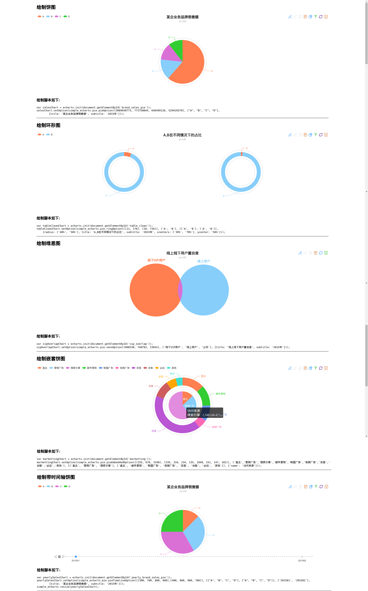

# simple_echarts
本库开发的目的是简化使用echarts绘制图表的过程, 将用户从echarts的option配置中解放出来, 使用户只用关心自己的数据, 其它
就交给simple_echarts来完成.

它本质上是默认化配置常用图表的option配置, 使用户不用去关心它, 如果用户对默认设置不满意, 则可以使用函数接口的options进行
少量自定义.

## 使用方法

###  文件引入

首先在引入echarts后, 将simple_echarts.min.js引入到<head>标签中:
```html
<script src='echarts-all.js'></script>
<script src='simple_echarts.min.js'></script>
```

### 饼图


### 雷达图


### 折线图


### 直方图


### 地图


### 字符云


## API接口
因时间关系, 没法在此将函数接口进行一一梳理, 想了解具体函数接口, 可以查看源文件的函数说明.
本库中每一个暴露的外部接口都配有详细的说明, 便于用户快速掌握.

欢迎用户积极补充.
